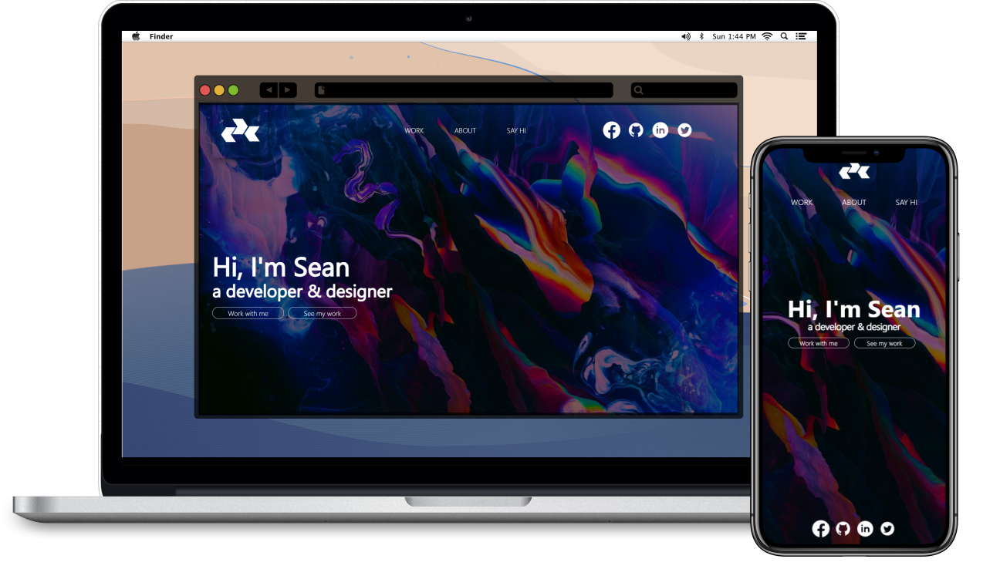
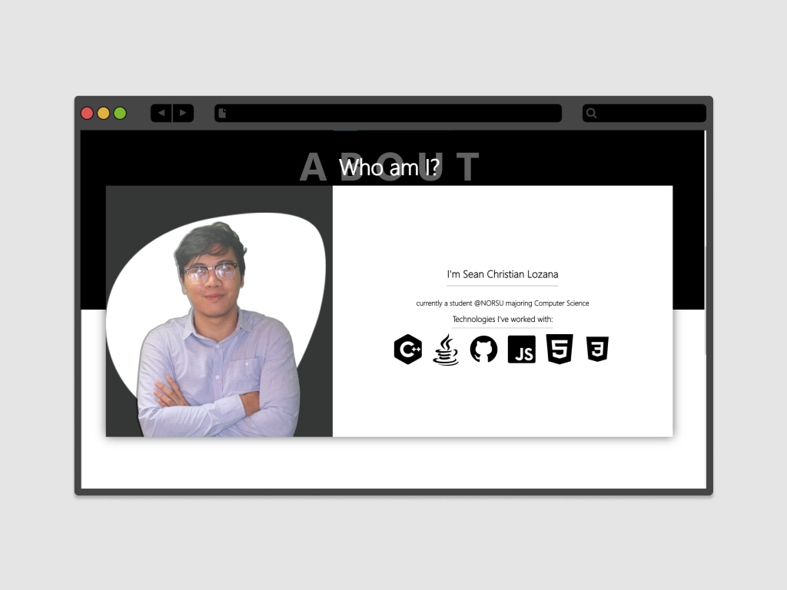
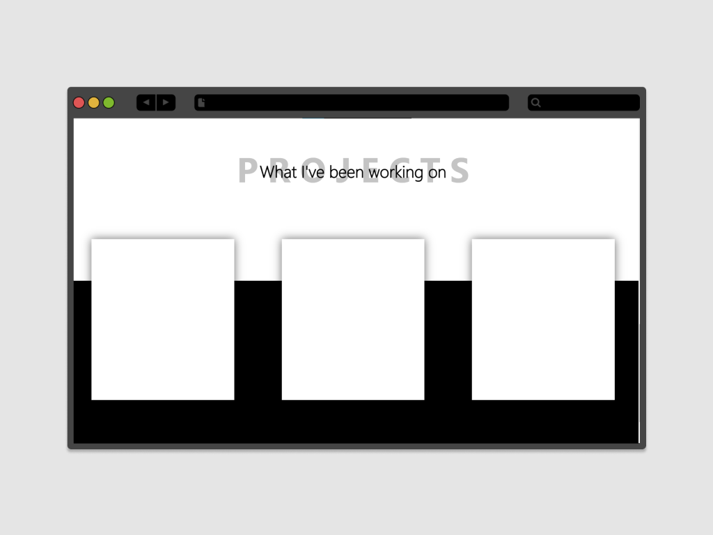

<!-- PROJECT LOGO -->
<br />
<p align="center">
  <a href="https://github.com/lozanasc-archives/First-Portfolio">
    
  </a>

  <h3 align="center">Portfolio  Mark-1</h3>

  <p align="center">
    My very first portfolio
    <br />
    <br />
    <a href="">Demo not available</a>
    ·
    <a href="https://github.com/lozanasc-archives/First-Portfolio/issues">Report Bug</a>
    ·
    <a href="https://github.com/lozanasc-archives/First-Portfolio/issues">Request Feature</a>
  </p>
</p>
<br/>
<p align="center">
  <a href=""><b>This project is archived and will not be receiving further updates<b/></a>
</p>


<!-- TABLE OF CONTENTS -->
<details open="open">
  <summary>Table of Contents</summary>
  <ol>
    <li>
      <a href="#about-the-project">About The Project</a>
      <ul>
        <li><a href="#built-with">Built With</a></li>
      </ul>
    </li>
    <li>
      <a href="#getting-started">Getting Started</a>
      <ul>
        <li><a href="#prerequisites">Prerequisites</a></li>
        <li><a href="#installation">Installation</a></li>
      </ul>
    </li>
    <li><a href="#usage">Usage</a></li>
    <li><a href="#roadmap">Roadmap</a></li>
    <li><a href="#contributing">Contributing</a></li>
    <li><a href="#license">License</a></li>
    <li><a href="#contact">Contact</a></li>
    <li><a href="#acknowledgements">Acknowledgements</a></li>
  </ol>
</details>


<!-- ABOUT THE PROJECT -->
## About The Project

  

This was created when I started learning Web Development, I started learning the basics back in the final semester of freshman year nearing summer so I wanted to upskill my coding skills by learning web dev, so I looked up what project should a beginner start with and it recommended me this... So tada I created my very first portfolio though unfinished because I hated the design ([I already have a new one 😉](https://lozanasc.github.io))

### Built With
This system was built with the following technologies:  
* [HTML](https://developer.mozilla.org/en-US/docs/Web/html)
* [CSS](https://developer.mozilla.org/en-US/docs/Web/css)


<!-- GETTING STARTED -->
## Getting Started

### Prerequisites

Let's start with the prerequisites, make sure you have the following installed in your local machine:  

* Browser

### Installation

1. Clone the repo
   ```sh
   git clone https://github.com/lozanasc-archives/First-Portfolio.git
   ```  
2. Open ```index.html```


<!-- USAGE EXAMPLES -->
## Usage
Hey there! If you're wondering why I only have _About_ and _Projects_ shown here, that is because I didn't finish it 😅 I know I'm lazy! 
### About

### Projects



<!-- ROADMAP -->
## Roadmap

See the [open issues](https://github.com/lozanasc-archives/First-Portfolio/issues) for a list of proposed features (and known issues).


<!-- CONTRIBUTING -->
## Contributing

Contributions are what make the open source community such an amazing place to be learn, inspire, and create. Any contributions you make are **greatly appreciated**.

1. Fork the Project
2. Create your Feature Branch (`git checkout -b feature/AmazingFeature`)
3. Commit your Changes (`git commit -m 'Add some AmazingFeature'`)
4. Push to the Branch (`git push origin feature/AmazingFeature`)
5. Open a Pull Request


<!-- LICENSE -->
## License

Distributed under the MIT License. See `LICENSE` for more information.


<!-- CONTACT -->
## Contact

Sean Christian Lozana - [@devzana](https://twitter.com/devzana) - lozanasc@gmail.com

Project Link: [Very first portfolio](https://github.com/lozanasc-archives/First-Portfolio)


<!-- ACKNOWLEDGEMENTS -->
## Acknowledgements
* [MDN](https://developer.mozilla.org/en-US/docs/)

